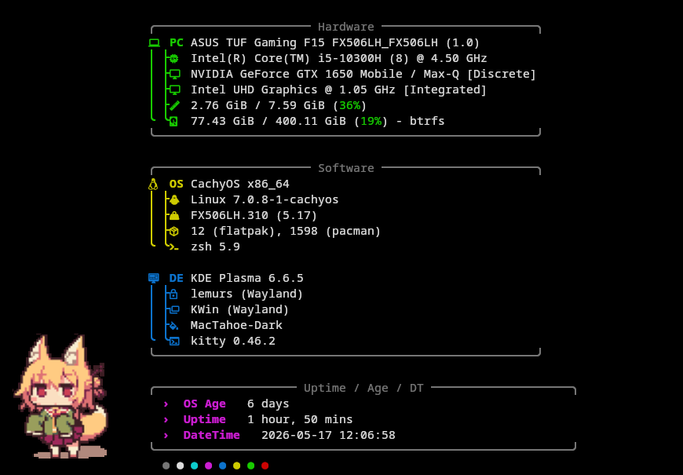

# fastfetch-dots

> [!IMPORTANT]
> This config requires using Kitty to work, since it uses the kitty-icat protocol.

Nice little fastfetch config that I use on my computer.

# Installation

Make sure you have Git installed on your computer to clone this repo.

```bash
git clone https://github.com/th1s-david/fastfetch-dots/
cd fastfetch-dots
chmod +x install.sh
./install.sh
```

# Preview
> [!NOTE]
> Preview is in an unconfigured Kitty terminal. It may look different in yours.



# Customizing
Modify `config.jsonc` to your liking. To add images or gifs, I recommend putting them in the images folder, so you only need to change the filename.
If you are changing the image, you should change the padding too.
